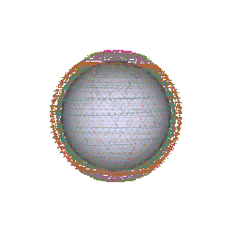

# Animation Only

If you would like to animate a satellite constellation, use the `animate.py`
program in the root of the repository like so:

```sh
python3 animate.py ./path/to/configuration.toml
```



In the [`animation`](./animation) directory, you can find two example
configuration files.

`starlink.toml` has all parameters for the complete Starlink phase I
constellation, so use that to animate that constellation:

```sh
# in /celestial root directory
python3 animate.py ./animation/starlink.toml
```

`geostationary.toml` has a single geo-stationary satellite in orbit
around earth.
