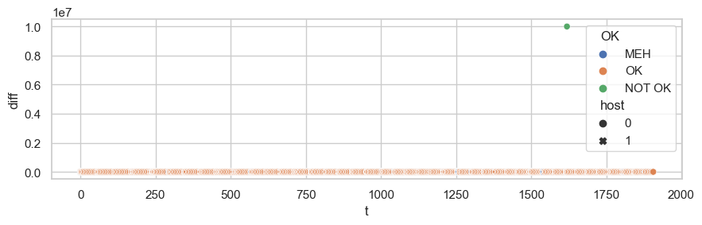
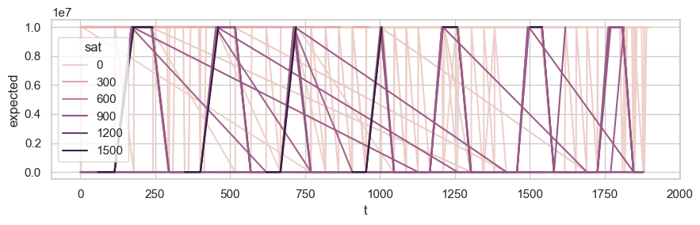
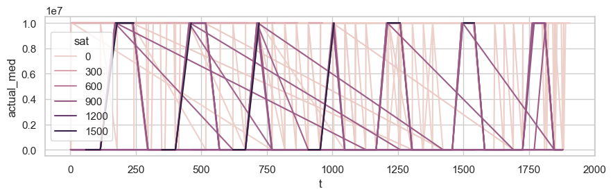
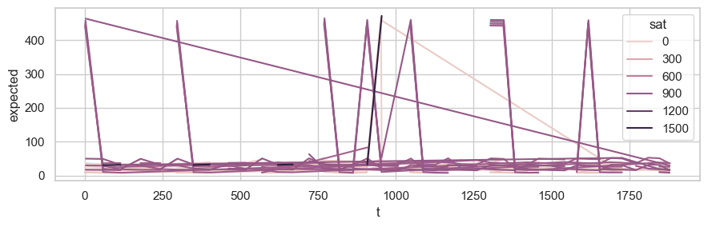

## Quick Start

This quick start guide is intended to ease you into using Celestial.
In this guide, we will build Celestial, set up some Google Cloud infrastructure
for it, and deploy an example application.

The example application is a simple network latency measurement application
written in Python called the `validator`.
It checks network latency reported by the Database service of Celestial and
compares it to ping measurements made using the `ping3` library.

This quick start guide was created using a fresh installation of Ubuntu 20.04.3
LTS on AWS EC2.
For optimal compatibility, we recommend that you use the same setup, but feel
free to ignore this advice if you know what you're doing.

We also assume you have access to a Google Cloud Platform account, as our
Celestial instances will be hosted on Google Compute Engine.

{: .text-yellow-300 }
**Disclaimer**:
Using Google Cloud Platform (or any other cloud service) can incur costs.
Proceed at your own risk.

{: .text-red-200 }
**Warning**:
We will be starting a few cloud machines in this tutorial!
We will be using two `n2-standard-32` instances ($4 per hour) and one
`n2-standard-8` instance ($0.50 per hour).
In the EU Frankfurt region, these machines currently cost $4.50 per hour.
This does not include additional charges for data transfer or disk.
We are not responsible for any costs that your project may incur.

### Install and Set Up Dependencies

Before we can start setting up Celestial, there are some dependencies we need
to take care of.
These steps are correct as of October 2022, but things change quickly.

1. Set up Docker to build everything.
    This follows the official [Docker documentation](https://docs.docker.com/engine/install/ubuntu/):

    ```sh
    sudo apt-get remove docker docker-engine docker.io containerd runc
    curl -fsSL https://get.docker.com -o get-docker.sh
    sudo sh get-docker.sh
    ```

    Proceed with the [post-installation steps for Linux](https://docs.docker.com/engine/install/linux-postinstall/):

    ```sh
    sudo groupadd docker
    sudo usermod -aG docker $USER
    ```

    Log out of your machine and log back in to see the changes.

1. Install the other dependencies:

    ```sh
    sudo apt-get update
    sudo apt-get install -y make git
    ```

1. Install terraform following the [official terraform documentation](https://www.terraform.io/downloads):

    ```sh
    curl -fsSL https://apt.releases.hashicorp.com/gpg | sudo apt-key add -
    sudo apt-add-repository \
        "deb [arch=amd64] https://apt.releases.hashicorp.com $(lsb_release -cs) main"
    sudo apt-get update
    sudo apt-get install terraform
    ```

1. We will be using Google Cloud Platform to host our Celestial servers.
    That means that you should set up a Google Cloud Platform project in your account.
    Read more about it [here](https://cloud.google.com/docs/concepts/projects).

    You should note the name of your project and install and configure the Google
    Cloud CLI accordingly (in this example, our project will be called `celestial-quick-start`).
    This setup is adapted from the [CLI documentation](https://cloud.google.com/sdk/docs/install):

    ```sh
    sudo snap install google-cloud-cli --classic
    gcloud init
    # press Y when asked to log in
    # follow the steps required to log in to your account

    gcloud auth application-default login
    # add your gcloud accoount to the Application Default Credentials
    # this let's Terraform use it
    ```

1. Clone the Celestial repository:

    ```sh
    cd ~
    git clone https://github.com/OpenFogStack/celestial
    ```

### Build Celestial

To build Celestial, your best option is to use the `celestial-compile` Docker
image.
Build this image with:

```sh
cd ~/celestial
docker build -f compile.Dockerfile -t celestial-make .
```

Then build `celestial.bin` with:

```sh
cd ~/celestial
docker run --rm -v $(pwd):/celestial celestial-make proto/
docker run --rm -v $(pwd):/celestial celestial-make celestial.bin
```

This will build the executable `celestial.bin` in the current directory.
This binary is what runs on your Celestial hosts.

The software on your Celestial coordinator can run in Docker and does not need
compilation beyond building the protocol buffer files.

### Building the Application

Applications on Celestial are embedded into a root filesystem that the microVMs
use.
This filesystem has an operating system, a set of packages, and any software
you need.
The easiest way to build a root filesystem is to use the provided Docker image.
Build this image with:

```sh
# make rootfsbuilder
cd ~/celestial/builder
docker build -t rootfsbuilder .
cd ..
```

This will give you the `rootfsbuilder` Docker image.
This Docker image already includes a copy of Alpine Linux.

We can now build the root filesystem for the validator application and for our
servers:

```sh
cd ~/celestial/quick-start/validator
docker run --rm \
    -v "$(pwd)/validator.py":/files/validator.py \
    -v "$(pwd)/validator.sh":/app.sh \
    -v "$(pwd)/validator-base.sh":/base.sh \
    -v "$(pwd)":/opt/code \
    --privileged rootfsbuilder validator.img

docker run --rm \
    -v "$(pwd)/server.sh":/app.sh \
    -v "$(pwd)":/opt/code \
    --privileged rootfsbuilder server.img
```

This builds the images `validator.img` and `server.img` in the current directory.
Any file mounted into the `/files` directory will be copied into the image
directly.
The `base.sh` file is a shell script that is run on the image while it is built,
which we use to install any necessary dependencies or to change any
configuration.
`app.sh` is the main application script that is run on the image when it is run.

You will also need a Linux kernel.
You can compile your own using the [manual we provide](./setup/application)
(it's really easy!) or download one from the Firecracker team:

```sh
cd ~/celestial/quick-start/validator
curl -fsSL \
    -o vmlinux.bin \
    "https://s3.amazonaws.com/spec.ccfc.min/img/quickstart_guide/x86_64/kernels/vmlinux.bin"
```

### Starting Celestial on Google Cloud Platform

To run Celestial on Google Cloud Platform, we need to create a few Google Compute
Engine instances.
In this quick start, we will use Terraform to deploy two host instances (`n2-standard-32`)
and one instance for the coordinator:

```sh
cd ~/celestial/quick-start/terraform
terraform init

# change these values to match your project
GCP_PROJECT="celestial-quick-start"
GCP_REGION="europe-west3"
GCP_ZONE="c"

# this will give you an overview of what Terraform is about to do
# check to see if everything looks right
terraform plan \
    -var gcp_project=$GCP_PROJECT \
    -var gcp_region=$GCP_REGION \
    -var gcp_zone=$GCP_ZONE

# type yes to confirm
terraform apply \
    -var gcp_project=$GCP_PROJECT \
    -var gcp_region=$GCP_REGION \
    -var gcp_zone=$GCP_ZONE
```

If you get an error that your Google Cloud quota is exceeded, log into the
Google Cloud Console and increase your quotas accordingly.

You can verify that the instances are running by running the following command:

```sh
# confirm that you see:
#   - celestial-coordinator
#   - celestial-host-0
#   - celestial-host-1
gcloud compute instances list --zones "$GCP_REGION-$GCP_ZONE"
```

The startup scripts on the instances will also install all the necessary
dependencies for us, we just need to upload our artifacts next.

### Uploading Artifacts

We can now copy all of our files to the instances.
We start by uploading Python files to the coordinator and building the container:

```sh
cd ~/celestial
COORDINATOR_INSTANCE="celestial-coordinator"

# the first copy command can take a while because gcloud copies access keys
# to the instance
gcloud compute scp --zone="$GCP_REGION-$GCP_ZONE" ~/celestial/Dockerfile $COORDINATOR_INSTANCE:.
gcloud compute scp --zone="$GCP_REGION-$GCP_ZONE" ~/celestial/*.py $COORDINATOR_INSTANCE:.
gcloud compute scp --zone="$GCP_REGION-$GCP_ZONE" ~/celestial/requirements.txt $COORDINATOR_INSTANCE:.
gcloud compute scp --zone="$GCP_REGION-$GCP_ZONE" --recurse \
    ~/celestial/celestial $COORDINATOR_INSTANCE:.
gcloud compute scp --zone="$GCP_REGION-$GCP_ZONE" --recurse ~/celestial/proto $COORDINATOR_INSTANCE:.

gcloud compute scp --zone="$GCP_REGION-$GCP_ZONE" \
    ~/celestial/quick-start/validator/validator.toml $COORDINATOR_INSTANCE:.

# build the coordinator
# this can take a minute, you can continue with something else
gcloud compute ssh --zone="$GCP_REGION-$GCP_ZONE" $COORDINATOR_INSTANCE \
    --command "sudo docker build -t celestial ."
```

With the coordinator ready, we can now upload files needed on the hosts and set
up the `/celestial` directory:

```sh
# copy image and binary to hosts
# adapt this if you change the name or amount of hosts
for i in {0..1}; do
    HOST_INSTANCE="celestial-host-$i"
    gcloud compute scp --zone="$GCP_REGION-$GCP_ZONE" \
        ~/celestial/celestial.bin $HOST_INSTANCE:.
    gcloud compute scp --zone="$GCP_REGION-$GCP_ZONE" \
        ~/celestial/quick-start/validator/validator.img $HOST_INSTANCE:.
    gcloud compute scp --zone="$GCP_REGION-$GCP_ZONE" \
        ~/celestial/quick-start/validator/server.img $HOST_INSTANCE:.
    gcloud compute scp --zone="$GCP_REGION-$GCP_ZONE" \
    ~/celestial/quick-start/validator/vmlinux.bin $HOST_INSTANCE:.

    gcloud compute ssh --zone="$GCP_REGION-$GCP_ZONE" $HOST_INSTANCE \
        --command "sudo mv validator.img /celestial/validator.img"
    gcloud compute ssh --zone="$GCP_REGION-$GCP_ZONE" $HOST_INSTANCE \
        --command "sudo mv server.img /celestial/server.img"
    gcloud compute ssh --zone="$GCP_REGION-$GCP_ZONE" $HOST_INSTANCE \
        --command "sudo mv vmlinux.bin /celestial/vmlinux.bin"

    # before we start, we need to reboot our hosts once
    # the reason is that we need to adapt file descriptor limits, which we do
    # with terraform during setup but which requires a reboot after
    gcloud compute ssh --zone="$GCP_REGION-$GCP_ZONE" $HOST_INSTANCE \
        --command "sudo reboot now"
done
```

### Starting the Experiments

We may now start the experiments.
To do so, we need to start the Celestial binary on each host, and we must start
the coordinator.

We recommend running these commands in different terminal windows or `screen`
sessions:

```sh
# start the hosts first:
# this command disables the systemd-resolved service
# this is necessary to clear port 53
$ gcloud compute ssh --zone="$GCP_REGION-$GCP_ZONE" "celestial-host-0"
ubuntu@celestial-host-0:~$ sudo systemctl stop systemd-resolved
ubuntu@celestial-host-0:~$ sudo ./celestial.bin

# in a second terminal window, start the second host
$ gcloud compute ssh --zone="$GCP_REGION-$GCP_ZONE" "celestial-host-1"
ubuntu@celestial-host-1:~$ sudo systemctl stop systemd-resolved
ubuntu@celestial-host-1:~$ sudo ./celestial.bin

# in a third terminal window, start the coordinator
$ gcloud compute ssh --zone="$GCP_REGION-$GCP_ZONE" "celestial-coordinator"
ubuntu@celestial-coordinator:~$ sudo docker run --rm -it \
    -p 8000:8000 \
    -v $(pwd)/validator.toml:/config.toml \
    celestial /config.toml
```

Your experiments are now running.
Leave them running for however long you want, for at least a few minutes.

### Monitoring the Experiments

There are a few things you can monitor while the experiments are running.
Of course there is the output of the coordinator, which tells you how long
individual updates took.
At the beginning of the emulation, starting everything can also take a long time
(2 minutes in our experiments).
Wait for the coordinator to say "machine manager ready!" before continuing.

The output of the hosts tells you about booting microVMs (you can adapt the
log level in the binary as well) and any errors that occur.

Any output of your microVMs' `stdout` and `stderr` is appended to individual
files, which you can view live.
For example, to follow the output of the validator, run this on the host that
is running the validator ground station:

```sh
$ tail -f /celestial/out/out-validator
trying sat 1442 shell 0
expect 10.811155/10.811155 for sat 1442 shell 0 and found 22.423506
trying sat 1443 shell 0
expect 4.217975/4.217975 for sat 1443 shell 0 and found 9.413958
trying sat 1464 shell 0
expect 12.332064/12.332064 for sat 1464 shell 0 and found 25.309563
trying sat 1465 shell 0
expect 5.738477/5.738477 for sat 1465 shell 0 and found 12.450695
trying sat 1486 shell 0
expect 13.849221/13.849221 for sat 1486 shell 0 and found 28.427362
trying sat 1487 shell 0
expect 7.255186/7.255186 for sat 1487 shell 0 and found 15.675306
...
```

Similarly, to follow the output of the satellite `1420` in shell `0`:

```sh
$ tail -f /celestial/out/out-0-1420
Wed Apr 27 11:48:46 UTC 2022: satellite server running
Wed Apr 27 11:49:46 UTC 2022: satellite server running
Wed Apr 27 11:50:46 UTC 2022: satellite server running
...
```

### Stopping Experiments and Downloading Results

To stop the experiments, simply execute Ctrl+C on the terminal windows of your
hosts and the coordinator.
You may have to do this a few times as the processes spawn a few subprocesses.

Our validator application creates a local file `validator.csv` in its filesystem.
To download the file from the filesystem, we must mount it on the first host:

```sh
$ gcloud compute ssh "celestial-host-0"
ubuntu@celestial-host-0:~$ mkdir -p ./tmp
ubuntu@celestial-host-0:~$ sudo mount /celestial/cevalidator.ext4 ./tmp -o loop
ubuntu@celestial-host-0:~$ cp ./tmp/root/validator.csv .
ubuntu@celestial-host-0:~$ sudo umount ./tmp
ubuntu@celestial-host-0:~$ rmdir ./tmp
# now get back out of the host
ubuntu@celestial-host-0:~$ exit
$ gcloud compute scp --zone="$GCP_REGION-$GCP_ZONE" \
    "celestial-host-0":./validator.csv ~/celestial/quick-start/validator_results.csv
```

You now have `validator_results.csv` on your machine and can continue to analysis.
Finally, do not forget to shut down your instances with:

```sh
cd ~/celestial/quick-start/terraform
terraform destroy \
    -var gcp_project=$GCP_PROJECT \
    -var gcp_region=$GCP_REGION \
    -var gcp_zone=$GCP_ZONE \
    --auto-approve
```

### Analysis

With our results files in hand, we can execute the `check_validator.py` script
to generate graphs that will help us understand the results.
To execute the script in Docker, use this command:

```sh
cd ~/celestial/quick-start
docker run -v $(pwd):/code --rm \
    -w /code \
    python:3.9-slim \
    /bin/bash -c " \
    python3 -m pip install -r requirements.txt && \
    python3 check_validator.py"
```

In the `graphs` folder, you should now see a few graphs:

```sh
$ ls -l graphs
total 432
-rw-r--r-- 1 root root 122402 Apr 27 13:40 actual_line.png
-rw-r--r-- 1 root root  13795 Apr 27 13:40 diff_ecdf.png
-rw-r--r-- 1 root root 122954 Apr 27 13:40 expected_line.png
-rw-r--r-- 1 root root  68932 Apr 27 13:40 reachable_actual.png
-rw-r--r-- 1 root root  67517 Apr 27 13:40 reachable_expected.png
-rw-r--r-- 1 root root  35348 Apr 27 13:40 results_scatter.png
```

Let's first look at `results_scatter.png`, which has all results plotted by time
with the color giving whether the difference between expected and actual was
acceptable:



It looks like almost all measurements turned out OK, there was only one measurement
where something was off.

Next, `diff_ecdf.png` shows the ECDF of the differences between expected and actual:


We see that around 60% of the measurements were spot-on, for 95% there was a difference
of 4ms or less.
Note that this could also happen when the expected value changes during a measurement
as we only log the median actual measurement.
Extending our application to capture and measure these effects is left as an exercise
for the reader.

Finally, we can compare `expected_line.png` and `actual_line.png` to see how the
expected and actual values change over time:




Note that these are different graphs.
They look almost exactly the same because the accuracy in Celestial is so high.

Filtering out measurements that are at 1e7, i.e., unreachable:




Again, there is hardly a difference.

### Conclusion

In this quick start tutorial, we have seen how to run a simple experiment with
Celestial.
Although even such a simple experiment requires a lot of setup, rest assured that
we have covered large parts of Celestial already.
Advanced use includes compiling custom kernels, tuning parameters, and building
custom applications.
